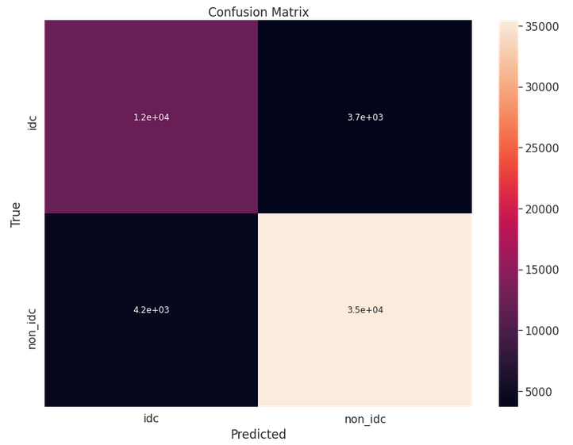

# 
 Modeling the Histopathology of Breast Cancer 

## 
Imaging breast tissue for invasive cancer 

## Introduction

Cancer has fascinated me since my high school days. It is a unique disease in that it is our own cells that cause us great harm. I obtained my Master's Degree by analyzing the disease-free survival of women with a benign (but potentially becoming malignant) form of breast cancer known as Ductal Carcinona *in situ*.

For this project, I wanted to look at breast cancer again, this time looking at a more aggresive form known as Invasive Ductal Carcinoma (IDC). This is a very serious form of breast cancer, and catching it treating it early is vital.

5-year survival for IDC located:*
* Only in the breast: 99%
* Regional lymph nodes: 86%
* Distant part of the body: 27%

To help identify IDC as early as possible, I sought to design a convolutional neural net (CNN) capable of identifying IDC from tumor specimen images.

To get a look at what the images look like, I have included an image of healthy breast histology and IDC breast histology below.

**Health Breast Histology1**

**IDC Breast Histology2**

## Data

The data consisted of 277,524 breast histopathologic images.
* 198,738 IDC negative
* 78,786 IDC positive

### Training Ddta set
222,020 images

### Validation data set

55,504 total images
* 39,672 IDC negative
* 15,832 IDC positive

## Results

### Images

A look at some of the images can lend some insight into which kinds of images the CNN classifies well and which ones it struggles to identify.

A correct non-IDC classification shows a lot of pink tissue.

A correct IDC classification shows a substantial amount of purple stain amongst the pink tissue.

Those two images were very easy for the CNN to classify correctly. However, when looking at a couple of misclassified images it is apparent that the CNN struggles when there is lots of pink, but the image conatins some purple. At this point, it is very difficult to tell the difference between an IDC positive image, and a negative one.

### Numbers

The confusion matrix below shows the results of the CNN compared with the true values from the validataion data set.

The metrics for the CNN were as follows:

* Accuracy: 85.7%
* Precision: 90.6%
* Recall: 91.9%

These are pretty good metrics for a classifer in general. However, when classifying cancer, we would like to have a model that incorrectly identifies cancerous tissue as little as possible. Identifying cancer as healthy tissue would be a very bad outcome.

A look at the ROC curve below lends some insight into ways to improve the model. In this curve, the True Positive Rate represents the rate at which healthy tissue is identified correctly and the false positive rate represents the rate at which cancerous tissue is identified as healthy. As such, we would like to improve the model so that the curve hugs the vertical axis as long as possible before it makes the turn at the top of the graph. This would ensure low rates of identifying cancer as healty while maintaining high rates of correct classifications of health tissue.

## Next Steps

There are several ways to take this project further. Those steps are listed out below.

* I would like to run more models and more powerful models through the use of big data resources like AWS
* I would like to use more data augmentation to give the model more looks at images to help train the model
* I would also like to perform a more in depth analysis of where the model fails.

All of these steps could help in the creation of a CNN that would be much more robust at identifying cancerous tissue.

## Sources

1[Normal breast at low power](https://webpath.med.utah.edu/HISTHTML/NORMAL/NORM005.html)

2[pathology.jhu.edu](ttps://pathology.jhu.edu/breast/types-of-breast-cancer/)

3[cancer.net](https://www.cancer.net/cancer-types/breast-cancer/statistics)